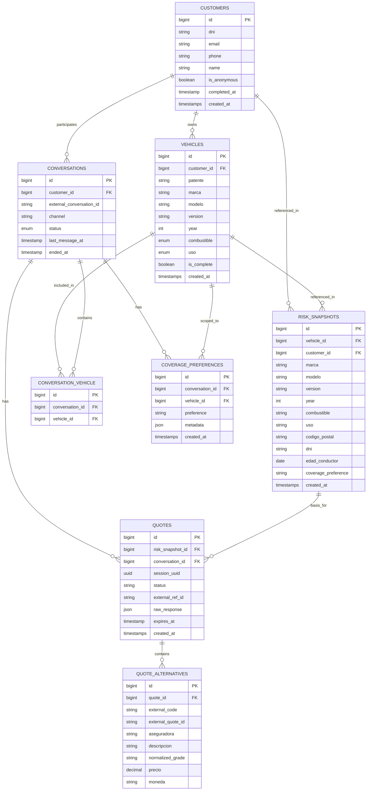

# FINAL Database Entity-Relationship Diagram

Este diagrama refleja la estructura final de la base de datos tras las discusiones de escalabilidad e identificación explícita de vehículos.

## Cambios Clave Incorporados

1.  **Eliminación de `is_primary`**: Se eliminó este atributo de la tabla pivote `CONVERSATION_VEHICLE`. El contexto ahora se resuelve explícitamente mediante la patente enviada en las herramientas.
2.  **Entidad `COVERAGE_PREFERENCES`**: Se agregó esta tabla para almacenar las preferencias de cobertura vinculadas a una combinación específica de conversación y vehículo.
3.  **Relaciones**: Se mantienen los vínculos fuertes entre `CONVERSATIONS`, `VEHICLES` y `COVERAGE_PREFERENCES`.
