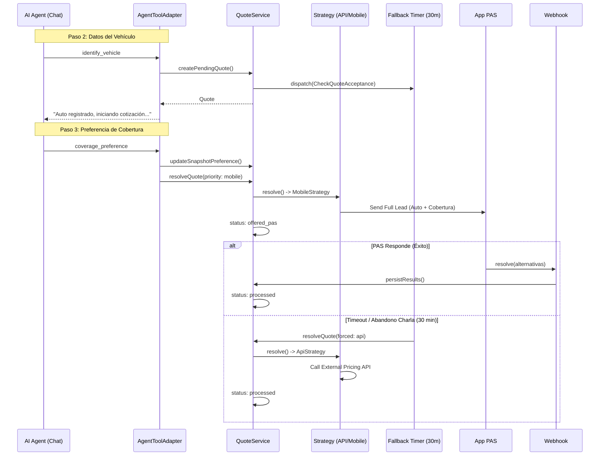

# Arquitectura de Resolución de Cotizaciones

Este documento detalla el flujo de trabajo y la división de responsabilidades en el sistema de cotización asíncrono con prioridades (PAS vs API).

## Componentes y Responsabilidades

### 1. El Orquestador: `AgentToolAdapter`
Es el punto de entrada desde el chat (OpenAI/Claude/etc.). Su responsabilidad es **detectar eventos** y disparar las acciones correspondientes en el sistema.

- **`identify_vehicle`**: Al recibir los datos del auto, ordena la creación de la cotización (`pending`) para iniciar el timer de fallback cuanto antes.
- **`coverage_preference`**: Al recibir la preferencia del cliente, actualiza el snapshot y solicita la resolución activa (Prioridad Mobile).

### 2. El Cerebro: `QuoteService`
Gestiona el ciclo de vida de la cotización y aplica las reglas de negocio globales.

- **`createPendingQuote`**: Crea el registro, toma el snapshot y programa el Job de Fallback (`CheckQuoteAcceptance`).
- **`resolveQuote`**: Selecciona la estrategia adecuada (`mobile` o `api`) y le delega la ejecución real.
- **`updateSnapshotPreference`**: Permite inyectar datos adicionales (como la cobertura) en el snapshot histórico antes de resolver.

### 3. Los Ejecutores: `Strategies` (Patrón Strategy)
Contienen la lógica específica de cada canal de cotización.

- **`MobileAppQuoteResolution`**:
    - Envía la oportunidad a la App de PAS.
    - Cambia el estado a `offered_pas`.
    - La resolución es **diferida** (espera al Webhook).
- **`ApiQuoteResolution`**:
    - Consulta motores de precios externos (APIs).
    - Persiste los resultados inmediatamente.
    - La resolución es **síncrona** (dentro del Job).

## Diagrama de Secuencia Completo

## Estados de la Cotización (`Quote status`)

1.  **`pending`**: Creada pero esperando datos de cobertura o respuesta del PAS.
2.  **`offered_pas`**: La oportunidad ha sido enviada a los productores manuales.
3.  **`rejected_pas`**: El tiempo terminó o los PAS rechazaron la oferta (dispara el fallback).
4.  **`processed`**: Cotización finalizada con éxito (vía PAS o API).
5.  **`failed`**: Error técnico en la resolución.

## Gestión de Tiempos (Source of Truth)

Este **Backend Core** es la única fuente de verdad para la expiración de la resolución:

- **Configuración Centralizada**: Definida en `config/services.php` (`mobile_app.timeout_minutes`), la cual lee la variable de entorno `MOBILE_APP_RESOLUTION_TIMEOUT`.
- **Timer de Fallback**: El Core inicia el cronómetro de 30 min (o el configurado) en el momento de creación de la `Quote`.
- **Comunicación**: El payload enviado a la App PAS incluye este tiempo (`expires_at`), para que la App sepa cuándo su oportunidad caducará, pero es el Core quien ejecuta el fallback síncronamente al cumplirse el plazo.
