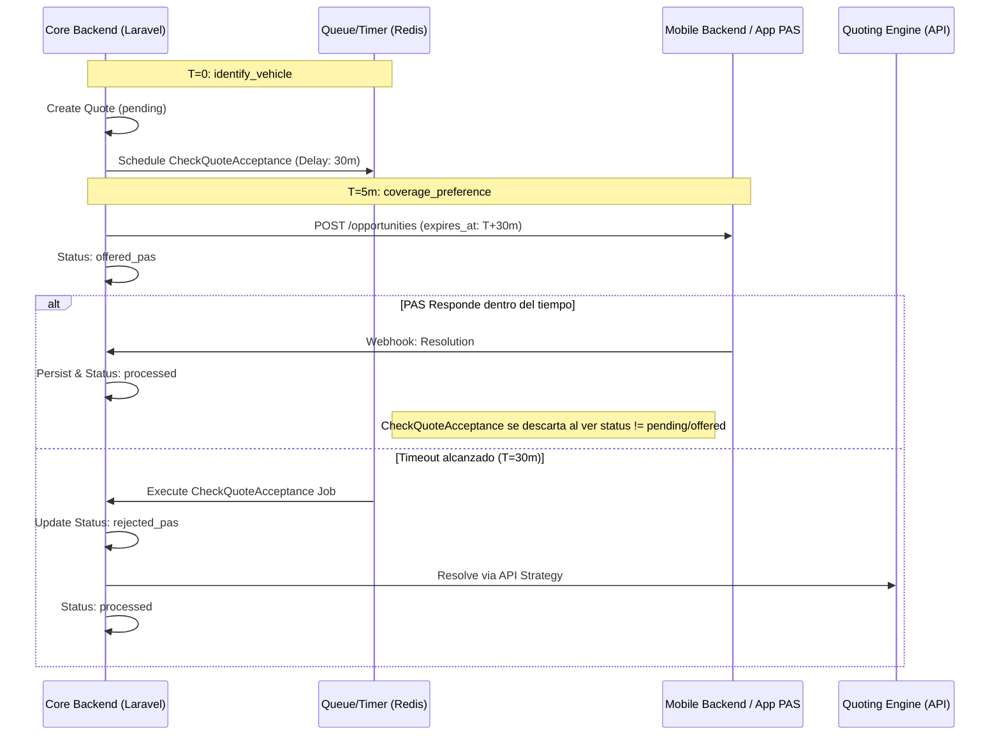

# Arquitectura de Gestión de Tiempos y Expiración

Este documento explica el diseño técnico detrás de la gestión de tiempos (timeouts) para la resolución de cotizaciones, y justifica por qué el **Core Backend** actúa como única fuente de verdad.

## Principios de Diseño

### 1. Garantía de SLA (Service Level Agreement)
La prioridad máxima es que el cliente reciba una cotización. Al centralizar el cronómetro en el Core, garantizamos que el fallback a la API se ejecute incluso si la App de los PAS tiene una falla técnica, está sobrecargada o pierde conectividad.

### 2. Propiedad del Estado (Data Ownership)
El registro de la cotización (`Quote`) reside en la base de datos de este backend. Siguiendo principios de DDD (Domain-Driven Design), el sistema que posee el dato debe ser el único responsable de transicionar sus estados. El cambio de `offered_pas` a `rejected_pas` (por timeout) es una transición de estado de negocio que el Core debe controlar.

### 3. Mitigación del Abandono de Conversación
El timer comienza en el momento en que el vehículo es identificado, no cuando el lead llega al PAS. Esto permite que el sistema trabaje en segundo plano mientras el cliente sigue hablando o si decide abandonar la charla temporalmente.

## Flujo de Implementación



## Beneficios Técnicos

| Beneficio | Descripción |
| :--- | :--- |
| **Unidireccionalidad** | El flujo de control fluye del Core hacia afuera. No hay dependencias circulares donde el móvil tenga que "avisar" que terminó su tiempo. |
| **Resiliencia** | Si la infraestructura móvil falla, este backend sigue cumpliendo con el cliente mediante el fallback automático. |
| **Consistencia UI** | Enviamos el timestamp `expires_at` exacto a la App PAS. Esto permite que la interfaz móvil muestre una cuenta regresiva sincronizada visualmente con la lógica del backend. |
| **Escalabilidad** | Podemos ajustar los tiempos de resolución globalmente en `config/services.php` sin necesidad de desplegar cambios en la App móvil. |

## Configuración

La única fuente de configuración es el archivo `.env` del Core:
```env
# Tiempo en minutos antes de disparar el fallback a API
MOBILE_APP_RESOLUTION_TIMEOUT=30
```
Esta variable es mapeada en `config/services.php` y consumida tanto por el **Servicio de Cotización** (para el timer) como por la **Estrategia Mobile** (para el payload JSON).
